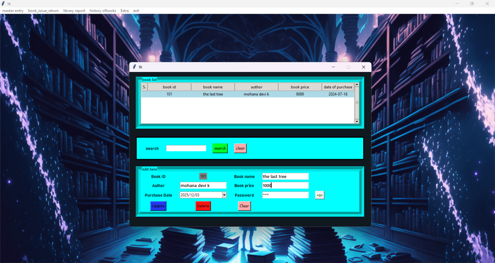

# 📚 Library Management System

A desktop-based **Library Management System** developed using **Python Tkinter** for the graphical user interface and **MySQL** for database management. The application simplifies library operations by managing books, members, book issuance, returns, and borrowing records through an intuitive and user-friendly interface.

---

## ✨ Features

- 📖 Add, update, and delete book records
- 👥 Add, update, and delete member records
- 🔄 Issue and return books
- ⏰ Automatic fine calculation for overdue book returns
- 📜 View borrowing history and unreturned books
- 🔒 Password protection for update and delete operations
- 🔍 Search books and members
- 🖥️ Interactive GUI developed using Tkinter

---

## 🛠️ Software Requirements

- Python 3.x
- MySQL Server
- Required Python libraries listed in `requirements.txt`

---

## 📷 Application Preview

<p align="center">
  
</p>

---

## 🚀 Installation & Setup

### 1. Clone the Repository

```bash
git clone https://github.com/yourusername/Library-Management-System.git
```

---

### 2. Install the Required Libraries

```bash
pip install -r requirements.txt
```

---

### 3. Configure MySQL Database

1. Create a MySQL database.
2. Create the required tables for the application.
3. Open `library_management_system.py`.
4. Replace the placeholder MySQL password with your own MySQL password.

```python
mysql_password = "your-password-here"
```

Example:

```python
mysql_password = "root123"
```

---

### 4. Image Resources

Ensure the **widget_images** folder is located in the same directory as `library_management_system.py`. The application automatically loads all GUI images from this folder.

---

### 5. Run the Application

```bash
python library_management_system.py
```

---

## ⚙️ Working Principle

1. The administrator manages books and member records through the graphical interface.
2. All records are stored securely in the MySQL database.
3. Books can be issued and returned using the built-in management system.
4. The application automatically calculates fines for overdue returns.
5. Users can quickly search for books and members.
6. Password authentication protects sensitive operations such as updating and deleting records.

---

## 🎯 Applications

- School Libraries
- College Libraries
- Department Libraries
- Public Libraries
- Personal Book Collections

---

## 🔮 Future Enhancements

- Barcode Scanner Integration
- QR Code Support
- Email Notifications
- Multi-user Authentication
- Dashboard Analytics
- Export Reports to PDF or Excel

---

## 👨‍💻 Author

Developed by **Mohana Devi K**.

Thank you for visiting this repository!


